# TravelDeals

host link:
https://vijaywar.github.io/TravelDeals/

For section wise code in different files and included using Jquery : https://github.com/vijaywar/TravelDeals-Split

I simple landing page that offers tour packages to Ladakh.
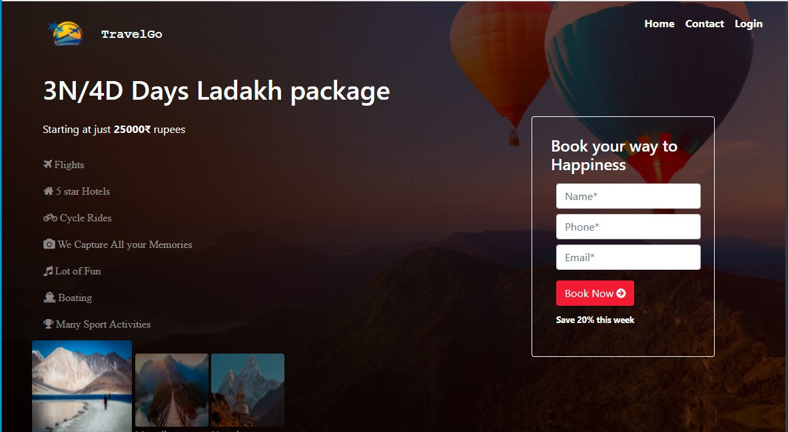
# Locations
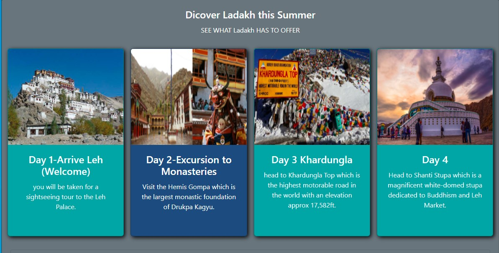
# Attraction images
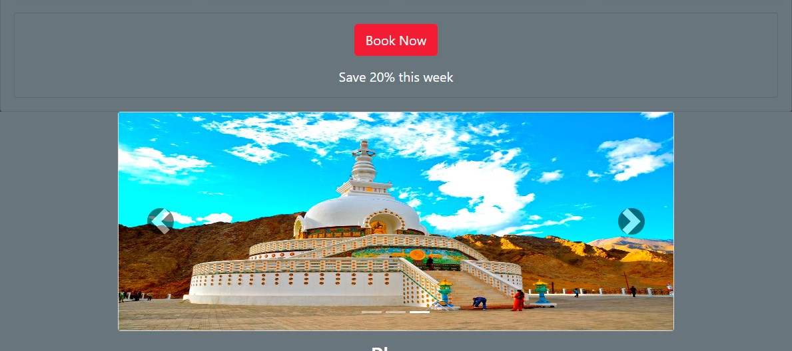
# Plans
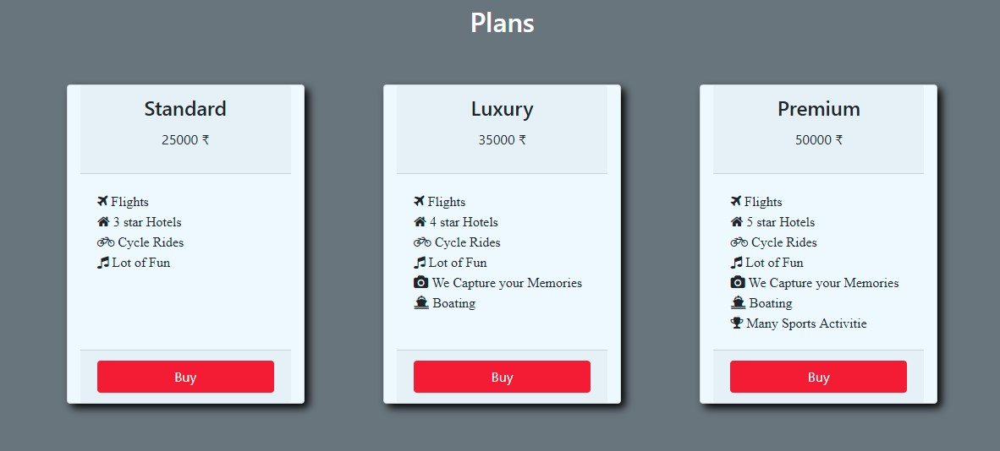
# Reviews
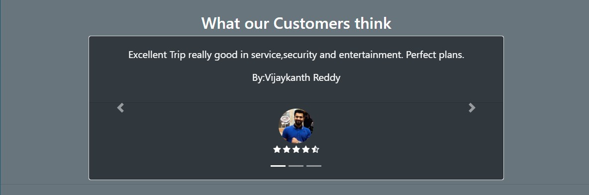
# Insta snaps
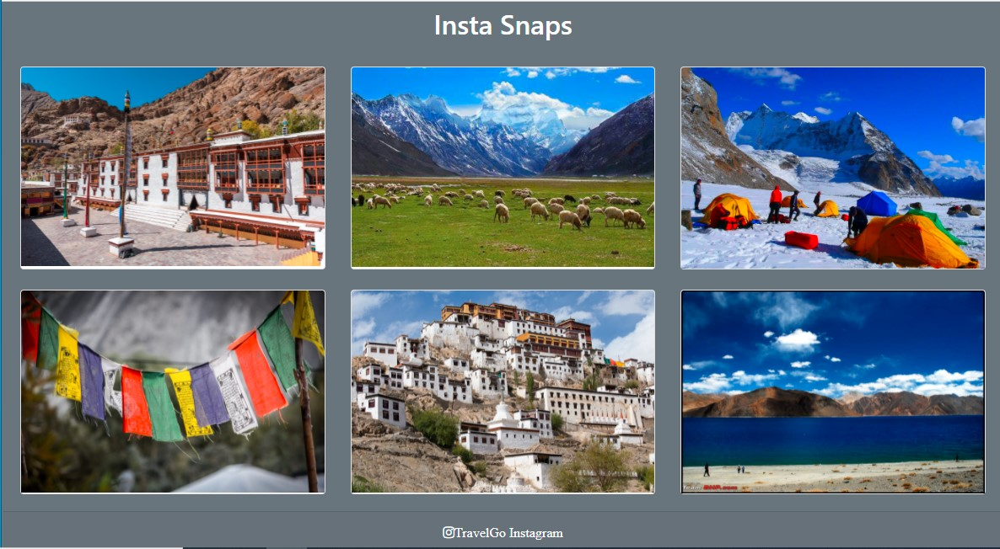
# footer and offer
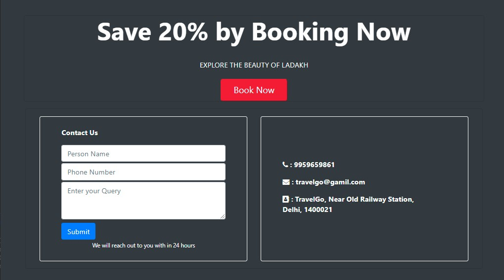

# Responsive

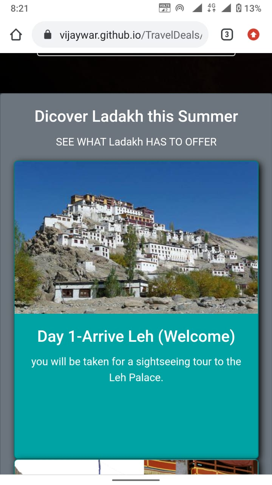
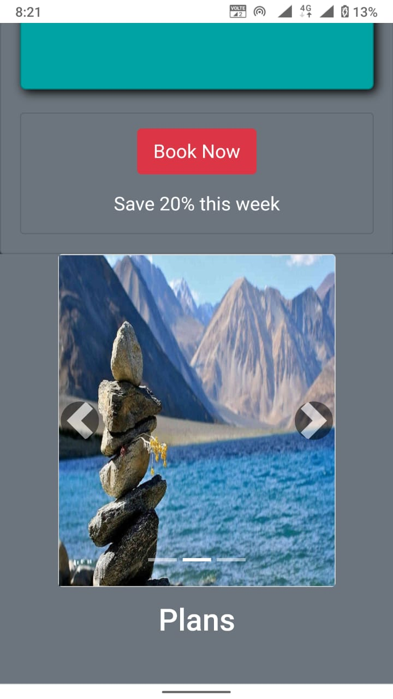
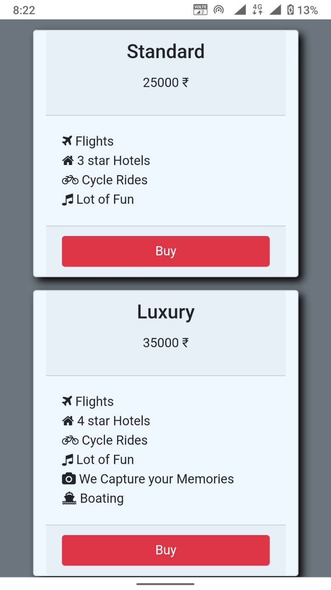
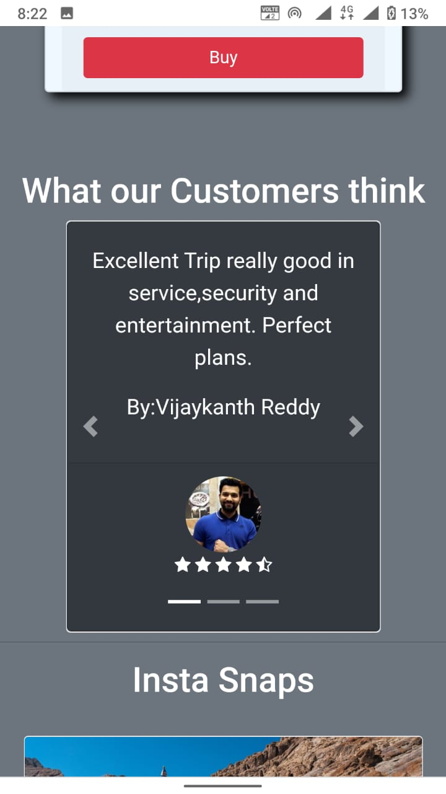
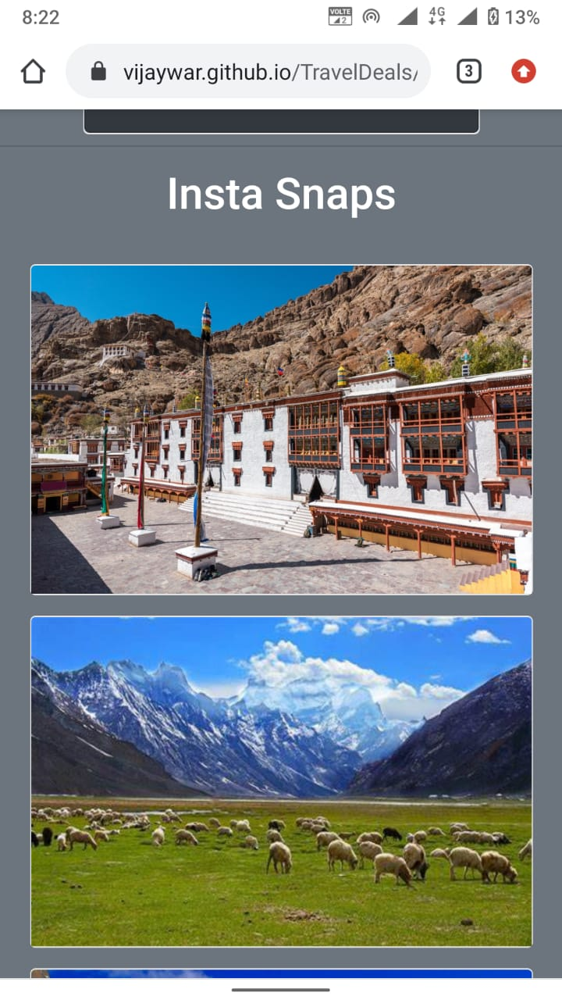

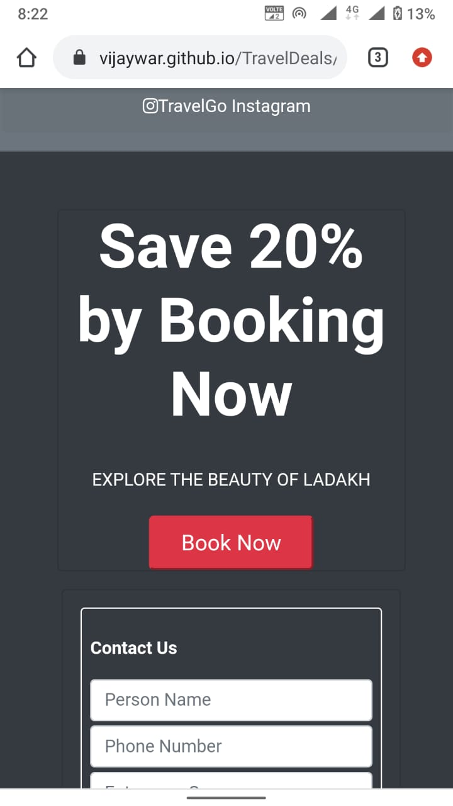